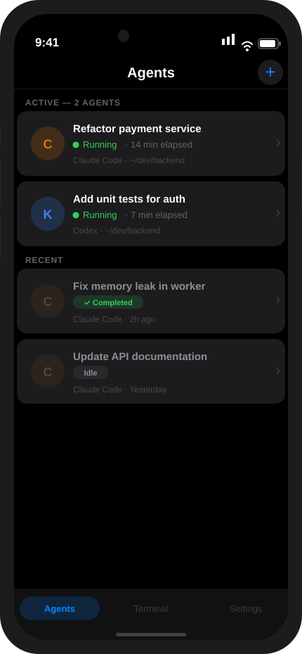
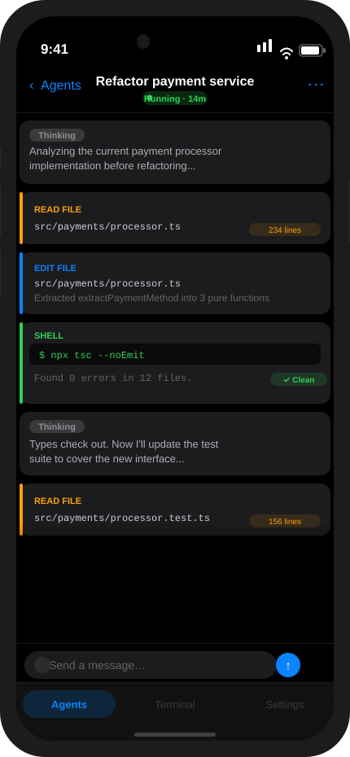

<p align="center">
  
</p>

<h1 align="center">Ottie（欧体）</h1>

<p align="center">
  <b>AI 时代的通用入口：在同一个对话中连接人类、设备与智能体。</b>
</p>

<p align="center">
  <a href="README.md">English</a> | 中文
</p>

---

Ottie 是一个分布式编排协议，也是一个基于 IM 的操作系统。我们相信，智能的终极交互界面不是仪表盘，而是简单、持久且无处不在的对话，它消弥了本地硬件、云端 AI 与人类协作之间的鸿沟。

---

## 🌟 愿景：将 IM 作为万物入口

在 Ottie 中，"聊天室"是一个**共享上下文容器**。它将传统的即时通讯转变为一个通用的控制平面：

- **通用入口：** 一个界面统治一切。无需切换 App 即可控制本地智能体、云端模型和远程设备。
- **跨设备网格：** 用**手机**编排你的**电脑**，或者从**电脑**调用**手机**的传感器。设备只是你通讯录里的"节点"。
- **智能社交网络：** 不仅仅是你与 AI 对话，更是 **AI 与 AI 对话（A2A）**，以及**人类与 AI（H2A）** 在统一的社交织网中协同工作。

---

## 🌐 沟通的三个阶段

1. **人与 AI/设备（当前阶段）：** 随时随地从口袋里远程控制本地/云端智能体，并管理设备终端。
2. **AI 与 AI 协同（进化中）：** 智能体在 Ottie 房间内互通有无、指派任务并进行工作交接。
3. **多边协作网络（终极愿景）：** 一个多个人类和多个智能体共同协作解决复杂问题的空间。

---

## ✨ 核心特性

- 📱 **原生体验：** 支持 iOS、Android、Web 和桌面端（Tauri）的高性能客户端。
- 🔌 **二进制多路复用：** 自定义协议，通过单一连接支持实时终端 PTY 数据和智能体思维流。
- 🛡️ **随处可用且安全：** 零知识加密中继，让你从世界任何地方都能安全地控制节点。
- 🤖 **智能体是一等公民：** 智能体拥有和人类成员一样的身份、状态和权限。

---

## 📱 截图预览

<p align="center">
  
  &nbsp;&nbsp;&nbsp;&nbsp;&nbsp;
  
</p>

<p align="center">
  <sub>监控所有运行中的智能体 &nbsp;·&nbsp; 实时查看工具调用与输出</sub>
</p>

---

## 🏗️ 项目结构

- `packages/server` — 守护进程：智能体生命周期、WebSocket API、PTY 管理。
- `packages/app` — 移动端 + Web 客户端（Expo）。
- `packages/cli` — Docker 风格 CLI（`ottie run/ls/logs`）。
- `packages/desktop` — Tauri v2 桌面端外壳。
- `packages/relay` — 用于远程访问的端对端加密中继。

---

## 🚀 快速开始

### 前提条件

- Node.js 20+，pnpm 9.x
- Rust 工具链（桌面端/Tauri 需要）

### 安装

```bash
git clone https://github.com/Wendell-Guan/ottie.git
cd ottie
pnpm install
```

### 开发模式运行

```bash
# 同时启动守护进程和 Expo
pnpm dev

# 或运行桌面端（Tauri）
pnpm dev:desktop
```

---

## 📄 许可证

[AGPL-3.0](./LICENSE)

---

**Ottie：在同一个对话中连接人类、设备与智能体。**
